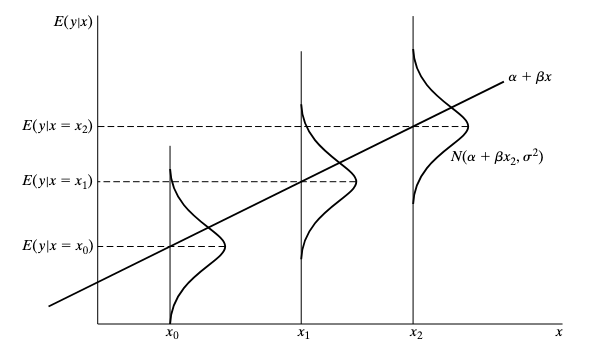

# Regression diagnostics

## Stressing the visual: Anscombe

Consider the following 4 datasets (constructed in 1973 by the statistician Francis Anscombe).

```{r}
anscombe
```

In each case the mean and variance of $Xs$ an $Ys$ are almost exactly the same:

```{r}
sapply(anscombe, mean)
sapply(anscombe, var)
```

We estimate 4 OLS models:

```{r}
# code from R help
ff <- y ~ x
mods <- setNames(as.list(1:4), paste0("lm", 1:4))
for (i in 1:4) {
    ff[2:3] <- lapply(paste0(c("y", "x"), i), as.name)
    mods[[i]] <- lmi <- lm(ff, data = anscombe)
    print(summary(lmi))
}
```

The quality of the fit and the regression coefficients are very similar across the 4 cases. But looking at it more closely, you see why a visual inspection is always needed:

```{r}
# code from R help
op <- par(mfrow = c(2, 2), mar = 0.1 + c(4, 4, 1, 1), oma = c(0, 0, 2, 0))
for (i in 1:4) {
    ff[2:3] <- lapply(paste0(c("y", "x"), i), as.name)
    plot(ff, data = anscombe, col = "red", pch = 21, bg = "orange", cex = 1.2, 
        xlim = c(3, 19), ylim = c(3, 13))
    abline(mods[[i]], col = "blue")
}
mtext("Anscombe's 4 Regression data sets", outer = TRUE, cex = 1.5)
```

## Visual diagnostics:

### Example

```{r}
RainScotland<-read.csv("data/Ferguson/RainScotland.csv")
OLS1<-lm(Rainfall~Elevation,data=RainScotland)
OLS2<-lm(Rainfall~Elevation+DistanceE,data=RainScotland)
summary(OLS2)
```

### Plots

`Plot()` applied to a `lm` object results in a sequence of 4 plots (out of 6 available) that are most useful for a visual inspection of the relationship you uncovered, as well as assessing whether the regression is valid and if any data behave as an outlier.

```{r}
par(mfrow=c(2,2))
plot(OLS2)
#same as
#plot(OLS2, which=c(1,2,3,5))
```

-   Plot 1 shows the distribution of residuals against the predicted $Y$ values. For a linear relationship, one expects that the residuals are equally distributed along the fitted values, i.e. spread similarly around the dashed horizontal line. Typically if the trend red curve would be clearly upward or downward sloping, or show (inverted-) U or V -shaped, that would mean the linearity assumption is not good. Some transformation or additional explanatory variables might be needed.

-   Plot 2 is a `qqplot` against the theoretical normal distribution (`qqnorm`). While we have seen that variations are more likely at the extremes, one expect the general shape of the curve to follow 1 to 1 straight line.

-   Plot 3 is often similar to plot 1, but more specifically aimed at finding if residuals are **homoscedastic**, i.e. have equal variance. The residuals are standardized (studentized) and the smoothed red line indicates changes in the variance. Again we expect it to be horizontal and the points to be equally distributed within a horizontal rectangle buffer.

-   Plot 5 shows standardized residuals (same as Plot 2) now plotted against `leverage`, indicating whether some points may influence the fit more than others. Points spotted far on the right side of the plot may deserve some attention, as their absence may significantly affect the coefficients of the model. In addition, isolines (0.5, 1, ...) of Cook's distance statistic is provided. Again values beyond those lines must be investigated as potentially too influential.

Plot 4 is actually the Cook's distance alone and plot 6 another way to represent both leverage and Cook's distance:

```{r}
par(mfrow=c(1,2))
plot(OLS2, which=c(4,6))
```

### Plots for Anscombe data

```{r}
par(mfrow=c(2,2))
plot(mods$lm2)
par(mfrow=c(2,2))
plot(mods$lm3)
```

## Exercise

Using the dataset Lux116.csv within the data folder and your previous models, assess whether linearity and homoscedasticity are likely and inspect the presence/effect of particulalry influencing observations

## Assumptions of regression models

Deriving from Greene (table 2.1), a classical regression model relies on a series of 6 assumptions:

1.  The model needs to specify a **linear relationship**, i.e. a linear combination. Yet it doesn't mean that the elements that are combined ($Y$ and or $X$) are not complex transforms (log, square, ...) thus leaving a lot of flexibility (semi-log, double-log,...) to describe a relationship.

2.  If there are several independent variables $X$, there cannot be an exact linear relationship among any of them (R would tell if that is the case). This is the **full rank** assumption. One $X$ cannot be a linear combination of some of the others.

3.  Disturbances (error terms) in each observation are fully random draw, meaning that they are not a function of any of the other independent variables at the observation. This implies that the mean of the disturbances conditional to obeseving the other variables in each observation is zero, and subsequently that the unconditional **mean of disturbances is** also **zero**. See we generated error terms with a zero mean in the previous chapter). This *exogeneity of the independent variables* condition is not very restrictive because if the mean would not be zero this could be captured by the intercept. It is only problematic when for some reasons one doesn't want an intercept (forces it to zero).

4.  Each disturbance term has the same finite variance *AND* is uncorrelated (independent) with every other. Having the same variance across observations is named **homoscedasticity** and being uncorrelatedness across observations is generically labelled **nonautocorrelation** (a special case of which is *spatial autocorrelation* where a correlation exists due to observations being neighbours in space) . When verifying the two assumptions, disturbances are sometimes said to be *spherical*.

5.  $X$ variables may be constants, dummy variables, or random variables but the process that generates them is unrelated to the process that generates the error terms.

6.  It is assumed for making tests that in addition to errors having a zero mean (Assumption 3) and a constant variance (homoscedasticity, Assumption 5), that their **distribution is normal**. Following the Central Limit Theorem, and assumptions on how the disturbances are generated, the normality assumption will be reached in most cases where sample size is large enough. Normality is not necessary to obtain regression estimates but useful to several statistical tests (confidence intervals).

Greene (p18), suggests the following view (see also or error terms generation process earlier) as a summary of the assumptions, showing that enquiring about the distribution of the residuals is key in a regression analysis in addition to making sure the regressors are independent. 



## Normality and homoscedasticity tests

While it is not required that the dependent variable ($Y$) is normally distributed, but the residuals, it is quite common to see authors transforming their original variable to achieve a more normal distribution before performing regression. The reason being that residuals may deviate from normality, more easily in the case of a non-normal $Y$. Most important however is to verify the homoscedasticity and normality of the residuals.

We refer to the hypothesis testing chapter for normality tests (Shapiro-Wilk) and visualisation and focus here on the Breusch-Pagan test of homoscedasticity, using the Scotland Rainfall models estimated earlier.

Note that if heteroscedasticity is found, the OLS estimated coefficients are not biased but the confidence interval we attach to them may be wrong.


```{r}
summary(OLS1)
summary(OLS2)
```
Starting with a histogram of the residuals:

```{r}
hist(resid(OLS1))
hist(resid(OLS2))
```

The Breusch-Pagan test (see R help) is found within the `lmtest` package. It fits a linear regression model to the residuals of a linear regression model. By default the same explanatory variables are taken as in the original regression. The null hypothesis (homoscedasticity) is then rejected if too much of the variance (of the residuals) is explained. The test statistic follows a chi-squared distribution with degrees of freedom  equal the number of regressors without the constant.

```{r}
lmtest::bptest(OLS1)
lmtest::bptest(OLS2)
```

In both cases, we can't reject the homoscedasticity, meaning our regressions are fine on that front.


